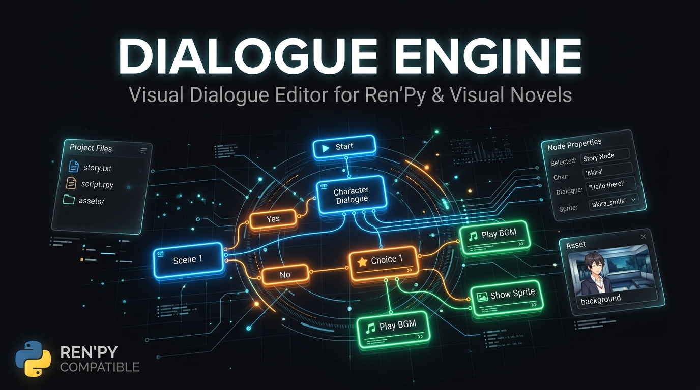

<p align="center">
  
</p>

<h1 align="center">🎭 Dialogue Engine</h1>

<p align="center">
  <b>A visual, node-based dialogue editor for Ren'Py and visual novel creators.</b><br>
  Design branching storylines visually, no coding required.
</p>

<p align="center">
  
  
  
  
  
</p>

<p align="center">
  <b>🇬🇧 English</b> | <a href="README_RU.md">🇷🇺 Русский</a>
</p>

---

## What is Dialogue Engine?

**Dialogue Engine** is a free, open-source visual editor for writing branching dialogues and stories. Think of it as a **node graph editor** specifically crafted for Ren'Py visual novel developers. Connect story nodes, choice nodes, and music nodes on an infinite canvas, then **export directly to `.rpy` script** with one click.

No more writing complex `menu:` blocks by hand. Just drag, connect, and export.

---

## Features

### Visual Node Editor
- **Infinite canvas** with smooth physics-based panning (arrow keys + middle mouse)
- **3 node types**: Story (dialogue), Choice (branching), Music/Audio
- **Rich text rendering** with per-word color highlighting
- Snap-to-grid layout

### Editing and Workflow
- **Undo / Redo** (Ctrl+Z / Ctrl+Y) up to 50 steps
- **Copy, Paste, Duplicate** selected nodes (Ctrl+C / Ctrl+V / Ctrl+D)
- **Marquee selection** drag to select multiple nodes at once
- **Search and Replace** across all node content
- **Unsaved changes indicator** so you never lose your work

### Export
- **One-click export to Ren'Py** `.rpy` script format
- Automatic `label`, `menu`, `jump`, `play music` generation
- **Test-Drive** launches your script directly in Ren'Py from the editor

### Plugin System
The editor has a built-in plugin architecture. Drop a `.py` file into the `plugins/` folder and it is auto-loaded on startup.

**Included plugins:**

| Plugin | Description |
|---|---|
| `renpy_exporter.py` | Exports the node graph to a valid `.rpy` script |
| `interactive_player.py` | Launches Ren'Py for instant test-driving |
| `music_plugin.py` | Music/Audio nodes with BGM and Voice modes |
| `fs_plugin.py` | File system sidebar with drag and drop for assets |
| `grammar_plugin.py` | Grammar and punctuation checker (via LanguageTool API) |
| `word_counter.py` | Live word count statistics |
| `advanced_scripting.py` | Advanced scripting node types |
| `core_nodes.py` | Core node behaviors and extensions |
| `flow_nodes.py` | Flow control nodes (jumps, conditions) |
| `reload_plugin.py` | Hot-reload plugins without restarting |

### Save and Load
- Projects saved as human-readable **JSON** files
- Full node graph serialization (positions, content, connections, custom data)

---

## Installation

### Requirements
- Python **3.8+**
- `tkinter` (included with standard Python on Windows)

### Run

```bash
git clone https://github.com/komendant-zero/dialogue-engine.git
cd dialogue-engine
python main.py
```

No external dependencies required. The editor runs on Python's standard library only.

---

## Usage

### Creating a Story

1. Click **"New Story"** to add a story node
2. **Double-click** a node to edit its content
3. Click **"New Choice"** to add a branching choice node
4. **Drag from the output port** (right side of a node) to the input port of another node to connect them

### Navigation

| Action | Shortcut |
|---|---|
| Pan canvas | Middle Mouse Button drag / Arrow Keys |
| Select multiple | Left-click drag (marquee) |
| Undo | Ctrl+Z |
| Redo | Ctrl+Y |
| Copy | Ctrl+C |
| Paste | Ctrl+V |
| Duplicate | Ctrl+D |
| Delete selected | Delete |
| Edit node | Double-click |
| Context menu | Right-click |

### Exporting to Ren'Py

1. Open your Ren'Py project
2. Click **"Export to Ren'Py"** in the toolbar
3. Select the `game/` folder of your Ren'Py project
4. A `script.rpy` file will be generated automatically

### Test-Drive

Click **"Test-Drive"** to launch Ren'Py directly from the editor. On first use, you will be prompted to locate your Ren'Py executable.

---

## Writing Your Own Plugin

The plugin system is simple and event-driven. Create a `.py` file in the `plugins/` folder:

```python
from plugin_system import Plugin

class MyPlugin(Plugin):
    name = "My Plugin"
    version = "1.0"

    def on_enable(self):
        print("Plugin loaded!")

    def on_event(self, event_type, data=None):
        if event_type == 'setup_ui':
            # Add your toolbar button here
            pass

        elif event_type == 'node_added':
            node = data
            print(f"New node: {node.title}")
```

### Available Events

| Event | Triggered When |
|---|---|
| `setup_ui` | Editor UI is being built (add toolbar buttons) |
| `node_added` | A new node is added to the canvas |
| `node_deleted` | A node is removed |
| `draw_node` | A node is being drawn (add custom visuals) |
| `draw_node_content` | Custom content rendering for a node |
| `draw_node_ports` | Custom port rendering |
| `calculate_node_size` | Override node size calculation |
| `node_edit_dialog` | Edit dialog is opening (add custom fields) |
| `node_edit_save` | Edit dialog is saving (read custom fields) |
| `save` | Project is being saved |
| `load` | Project is being loaded |

---

## Roadmap

- [ ] Cross-platform support (macOS and Linux)
- [ ] Zoom in/out on the canvas
- [ ] Conditional branching nodes (variables and flags)
- [ ] Character manager
- [ ] Background and sprite preview in nodes
- [ ] Export to other formats (Twine, Ink, custom JSON)
- [ ] Auto-layout / arrange nodes

---

## Contributing

Contributions are very welcome! Here is how to get started:

1. **Fork** the repository
2. **Create a branch** for your feature (`git checkout -b feature/amazing-feature`)
3. **Commit** your changes
4. **Push** and open a **Pull Request**

Plugin contributions are especially appreciated. The plugin system makes it easy to add new node types, exporters, or tools without touching the core editor.

---

## License

This project is licensed under the **MIT License**, see the [LICENSE](LICENSE) file for details.

---

## Acknowledgements

- Built with Python and Tkinter
- Grammar checking powered by [LanguageTool](https://languagetool.org/) (via public API)
- Inspired by visual scripting tools like Twine and Yarn Spinner
- Made for the [Ren'Py](https://www.renpy.org/) visual novel community

---

<p align="center">Made with love for visual novel creators</p>
